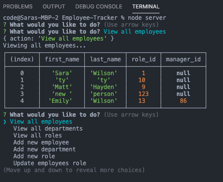

## Description

An application in the command line that allows you to view, add, update and remove employees, roles, and departments for a users company. A combination of mysql and inquirer prompts.

## Business Context
As someone who is a manager or HR of a company, I want a quick application that allows me to add new employees, remove old employees, and update roles and departments. It is user friendly and will store the information in a database for when you need to access it again.

## Installatiion
npm init -y
npm i mysql inquirer

## Usage
Click below to see a recording of how the application works!

## TEST
node server.js

## Deployed App

## Questions
`Github: sawi4644`
`Email: sarakatewilson98@gmail.com`

